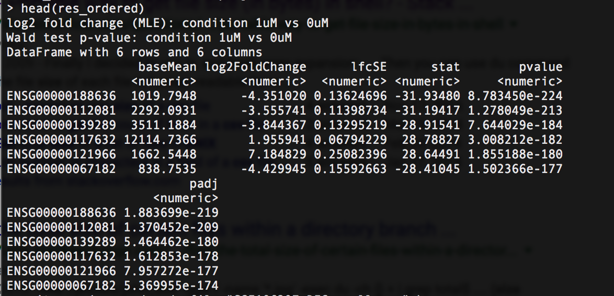

```{r setup, include=FALSE}
knitr::opts_chunk$set(echo = TRUE)
library(here)
```

# Introduction 

### Doxorubicin-induced cardiotoxicity 

Doxorubicin is a commonly used chemotherapy drug for many different types of cancer. The means by which Doxorubicin treats cancer is by virtue of topoisomerase II inhibition (7). Topoisomerase II cleaves both strands of DNA in order to relieve stress caused by supercoiling, making it key enzyme in the DNA replication process. By inhibiting topoisomerase II, Doxorubicin prevents the division and growth of cancer cells, but also normal, healthy cells as a ramification.
 
One of the most alarming side effects of Doxorubicin is cardiotoxicity, which is damage to the heart resulting from drugs or chemicals. Damage can range from the weakening heart muscle walls, a decreased ventricular ejection fraction, arrhythmias, and heart failure. Genetic changes arising as a result of Doxorubicin can be observed and analyzed via RNA sequencing. The presence of Troponin I and brain natriuretic peptide (BNP) are apt to change with the introduction of Doxorubicin in cells. For this reason, Troponin I and BNP may serve as biomarkers, indicating the presence and degree of cardiotoxicity during RNA analysis. With the means to analyze cardiotoxicity by RNA analysis, there is the potential to further comprehend Doxorubicin's mechanisms of action and recommend other remedial points.


### RNA Sequencing 

RNA sequencing is a powerful tool that can be utilized for a variety of purposes, including the quantification of differential gene expression in various pathologies, mutations, or intentional conditions. Here, we plan to utilize RNA sequencing to elucidate any changes in gene expression, specifically in cardiomyocytes, that result from doxorubicin administration to cancer patients. 

This process begins in the laboratory when total RNA is extracted from the tissue or group of cells of interest. Total RNA in most cells, however, is composed chiefly of ribosomal RNA (rRNA) that usually does not provide useful information about changes in gene expression. Thus, different experimental procedures are performed depending on the desired type of RNA; for example, ribo-depletion can be used to remove rRNA from the total RNA sample or poly-A selection can be used to isolate mature mRNA transcripts, as all mature mRNA's have a poly-A tail. After total RNA is obtained and the specific desired type of RNA is isolated, the selected RNA is converted to complementary DNA (cDNA) using reverse transcriptase. The cDNA is then sequenced on a high-throughput technology that allows for the rapid generation of numerous copies of the cDNA for subsequent analysis. 

# Methods and Materials

### Obtaining data

All data sets used in this study were obtained from GEO. Two separate data sets comparing the effects of DOX on cardiomyocytes were studied. The first data set compared human embryonic stem cell derived cardiomyocytes that were treated with 0, 1, or 2.5 μm of DOX for 16 hours (4). The second data set studied obtained human-induced pluripotent stem cell derived cardiomyocytes from six female breast cancer patients that were treated with DOX. Three of these patients experienced cardiotoxicity as a result of DOX treatment, whereas three did not. These stem cells were then treated with either 0 or 1 ?m of DOX for 24 hours (1). Both data sets were processed via the platform Illumina HiSeq 2000 for high throughput sequencing. 


### Mapping reads to reference transcriptome

Salmon is a tool used for transcript quantification given a set of target transcripts from RNA-sequence data. One very useful feature of Salmon is the capability to correctly assess RNA transcripts using quasi-mappings. Quasi-mappings are highly accurate in determining the order of nucleotides within RNA strands using several efficient data structures. Salmon uses quasi-mapping in two phases: indexing and quantification. Indexing pre-processes the text/data to compress the size of the data/text. The quantification step allows for the analysis of RNA reads from the dataset.

### Quantifying differential gene expression

DESeq2 is an R package that helps detect differentially expressed genes by using negative binomial linearized models. The dispersion and fold change estimates are studied using data driven distributions. DESeq2 takes input data from alignment applications, and outputs the number of reads that align to a transcriptome, the number of fragments per kilobase of exon per one million reads mapped (gene FPKM), and a comparison between the control and experimental data that compares gene expression in different tissues (6). The DESeq2 pipeline contains three brief steps; the estimation of size factors, which affect the sequencing library size, the estimation of dispersion for each gene, and fitting a generalized linear model. Counts for each gene are modeled using a negative binomial distribution, which is then used to derive a model for fold change of each gene in log base two and to derive the a model for the level of dispersion, which is calculated from the variance of the counts of the gene. (3). 


# Anticipated Results

While no studies have found a specific change in gene expression that directly results in cardiotoxicity of doxorubicin-treated cardiomyocytes, previous research has shown that cardiotoxicity of doxorubicin is caused by iron accumulation in cardiomyocyte mitochondria (2). Iron has redox properties that can catalyze production of reactive oxygen species, thereby inducing toxicity in cells where it is in high concentrations. Importantly, the mitochondrial protein ABCB8 facilitates iron export from mitochondria and overexpression of its genes has actually been shown to be therapeutic against doxorubicin-induced cardiotoxicity. Based on this finding, a potential cause of the iron accumulation and subsequent toxicity in cardiomyocytes could be the overexpression of a protein that facilitates iron transport into mitochondria or the underexpression of a mitochondrial protein that facilitates iron export.
  
In fact, cellular and mitochondrial iron metabolism is a burgeoning field of research  (5). The regulation of mitochondrial iron uptake and export are not yet completely elucidated; however, involved proteins may include mitochondrial ferritin (involved in iron storage) and mitoferrin-1 and -2 (involved in transport of iron). We hypothesize that the genes for these proteins may be altered in cases of doxorubicin-induced cardiotoxicity.

# Preliminary Results
Salmon was used to quantify the RNA sequencing data from the GSE106297 dataset. Raw data for the 0 and 1 μM doxorubicin treatment conditions were obtained from GEO/SRA, and converted to FASTQ format using the SRA toolkit (due to the large size of the runs, the analysis was performed using the Rivanna High-Performance Computing Cluster):

```
module load sratoolkit
prefetch -v SRR6231704
fastq-dump --split-files /home/meg5ww/ncbi/public/sra/SRR6231704.sra
```

In the above code, SRR6231704 represents one of the SRA runs downloaded and converted to FASTQ format. SRA runs SRR6231704-SRR6231711 were used in this analysis, as these are the runs corresponding to the 0 μM doxorubicin (SRR6231704-SRR6231707) and 1 μM doxorubicin (SRR6231708-SRR6231711) treatment conditions. Since the SRA files contained paired-end sequencing data, `--split-files` was needed to produce two FASTQ files per run, one for R1 and one for R2. 

Next, Salmon was used to download a reference transcriptome for *Homo sapiens* and build an index on this transcriptome. 

```
module load salmon

curl ftp://ftp.ensembl.org/pub/release-86/fasta/homo_sapiens/cdna/Homo_sapiens.GRCh38.cdna.all.fa.gz -o hsapiens.fa.gz

salmon index -t hsapiens.fa.gz -i hsapiens_index
```

Salmon was then used to quantify the RNA sequencing data for each run: 

```
salmon quant -i hsapiens_index -l A -1 SRR6231704_1.fastq -2 SRR6231704_2.fastq -o transcripts_quant_SRR6231704
```

These Salmon commands created an output file called `quant.sf` in an appropriately numbered `transcripts_quant` directory for each run. The `quant.sf` files were then imported into DESeq2 using the `tximport` R package: 

```
# load libraries
library(tximportData)
library(tximport)
library(EnsDb.Hsapiens.v86)
library(DESeq2)

# location of files
setwd("/scratch/meg5ww/bme4550/salmon_quant/")
dir<-"/scratch/meg5ww/bme4550"
files_list = list.files()
names(files) <- c("0uM_A1","0uM_A2","0uM_B1","0uM_B2","1uM_A1","1uM_A2","1uM_B1","1uM_B2")

# import transcript-level estimates generated using Salmon
txdf <- transcripts(EnsDb.Hsapiens.v86, return.type="DataFrame")
tx2gene <- as.data.frame(txdf[,c("tx_id", "gene_id")])
txi.salmon <- tximport(files, type = "salmon", tx2gene = tx2gene, ignoreTxVersion = TRUE)

# assign experimental variables - 0 or 1 μM doxorubicin treatment
condition = factor(c("0uM","0uM","0uM","0uM","1uM","1uM","1uM","1uM"))
exp_design <- data.frame(row.names=colnames(txi.salmon$counts), condition = condition)

# run DESeq2
dds <- DESeqDataSetFromTximport(txi.salmon, ExpDesign, ~condition)
dds <- DESeq(dds, betaPrior=FALSE)

# get counts
counts_table = counts(dds, normalized=TRUE)

# differential expression results 
res <- results(dds,contrast=c("condition","1uM","0uM"))
res_ordered <- res[order(res$padj),]
write.csv(res_ordered, file="GSE106297_DESeq_all.csv" )
```

In importing the transcript-level estimates, a `tx2gene` data frame was created to match the transcript IDs present in the files generated using Salmon with gene IDs (using the `EnsDb.Hsapiens.v86` annotation package since the *Ensembl Homo sapiens* v86 transcriptome was used as the reference transcriptome). Running the `results` function on the DESeqDataSet object `dds` creates a results table with log2 fold change, p-values, and adjusted p-values for each gene. This table was then arranged in order of ascending adjusted p-value. The output of the resulting `res_ordered` data frame is shown below (Figure 1). 



# Future Directions 

The output of this study - which we hope to be the elucidation of cardiomyocyte differential gene expression promoted by doxorubicin - can provide valuable information to physicians regarding potential secondary therapies to avoid cardiotoxicity in cancer patients. Future studies will include the addition of another experimental condition that includes patients administered both doxorubicin simultaneously with an anti-cardiotoxic (like Dexrazoxane) medication. Additionally, although this would not entail an RNA sequencing analysis, we would like to report the cancer-related outcomes of patients administered doxorubicin to evaluate its chemotherapeutic efficacy.

# Bibliography 

1. Burridge, P.W., Li, Y.F., Matsa, E., Wu, H., Ong, S.-G., Sharma, A., Holmstr?m, A., Chang, A.C., Coronado, M.J., Ebert, A.D., et al. (2016). Human induced pluripotent stem cell-derived cardiomyocytes recapitulate the predilection of breast cancer patients to doxorubicin-induced cardiotoxicity. Nat. Med. 22, 547-556.

2. Ichikawa, Y., Ghanefar, M., Bayeva, M., Wu, R., Khechaduri, A., Prasad, S.V.N., Mutharasan, R.K., Naik, T.J., and Ardehali, H. (2014). Cardiotoxicity of doxorubicin is mediated through mitochondrial iron accumulation. J Clin Invest 124, 617-630.

3. Love, M.I., Huber, W., and Anders, S. (2014). Moderated estimation of fold change and dispersion for RNA-seq data with DESeq2. Genome Biology 15.

4. Maillet, A., Tan, K., Chai, X., Sadananda, S.N., Mehta, A., Ooi, J., Hayden, M.R., Pouladi, M.A., Ghosh, S., Shim, W., et al. (2016). Modeling Doxorubicin-Induced Cardiotoxicity in Human Pluripotent Stem Cell Derived-Cardiomyocytes. Sci Rep 6, 25333.

5. Richardson, D.R., Lane, D.J.R., Becker, E.M., Huang, M.L.-H., Whitnall, M., Rahmanto, Y.S., Sheftel, A.D., and Ponka, P. (2010). Mitochondrial iron trafficking and the integration of iron metabolism between the mitochondrion and cytosol. PNAS 107, 10775-10782.

6. (2014). What the FPKM? A review of RNA-Seq expression units.

7. (2017). Doxorubicin (Adriamycin) | Cancer drugs | Cancer Research UK.